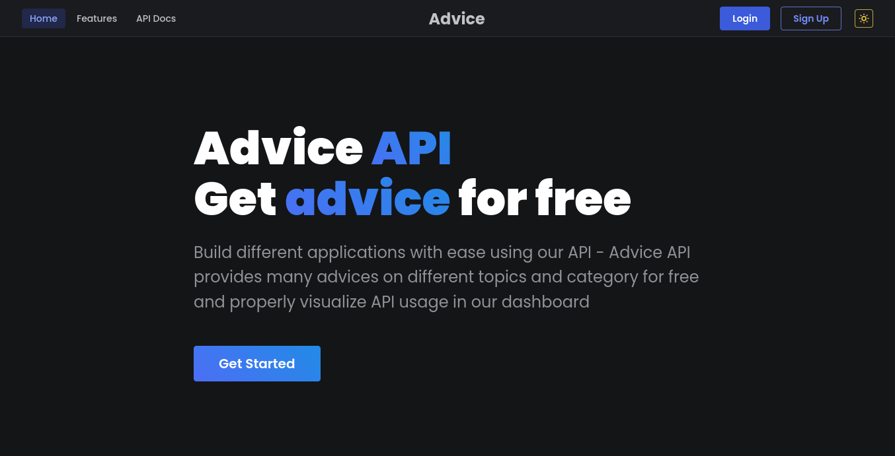

# Advice API Website!

Advice API is a full stack fully responsive website made with Next Js for both front-end and  for back-end. 

## Table of contents
- [Overview](#overview)
	 - [Screenshot](#screenshot)
	- [Run Project](#run)
	 - [Links](#links)
- [My process](#my-process)
  - [Built with](#built-with)
  - [What I learned](#what-i-learned)
- [Author](#author)

## Overview
Front-end part includes home page, features page, API docs page with instructions to use the API. It also includes user dashboard, modal for login and signup. I have also implemented dark and light theme.

The website also support server side rendering. Main aim of building this page was user authentication and data management. So, in the back-end the website will be fetching the data from [Advice JSON API](https://api.adviceslip.com/) , record the API calls and provide the fetched data to the user. 

User should create account and will get the apikey which they can use to fetch the data from our API. User will get 15 credits daily and they can fetch data from our API. Users won't be able to request once the credits is finished. Once logged in, users can see their stats of API usage in their dashboard. They can properly see stats in the form of chart. They can also change their password (once a week) and email  (once a month).

### Screenshot

### Run
Clone the project

    git clone https://github.com/exxnnonymous/full-stack-advice-api.git
Build the app

    npm run build
Start the app

    npm start

### Links
- Live Site URL: ()

## My process

### Built with
- CSS modules and [createStyles](https://mantine.dev/theming/create-styles/) (css-in-js library) - For styling
- [tabler-icons-react](https://tabler-icons-react.vercel.app/) - For icons
- Context API and useReducer Hook - To manage state
- [Next Js](https://nextjs.org/) - React Framework
- [Mantine](https://mantine.dev/) - React Component Library
- [Chart Js](https://www.chartjs.org/) - For Line Chart
- MongoDB and Mongoose for Database
- [Advice JSON API](https://api.adviceslip.com/) - To fetch advice slips
- Axios to fetch data, bcrypt for hashing user password and implemented jsonwebtoken and cookie for secure user authentication.

### What I learned

I learned a lot while building this website. I learned a react component library ([mantine](https://mantine.dev/)), because of which i could easily build responsive website and focus more in back-end. I learned more about user authentication and to make website secure implementing jsonwebtoken and cookie. I learned to manage the state using Context API and useReducer Hooks. I also learned a lot on CRUD.

## Author

- Twitter - [@exxnnonymous](https://www.twitter.com/exxnnonymous)
